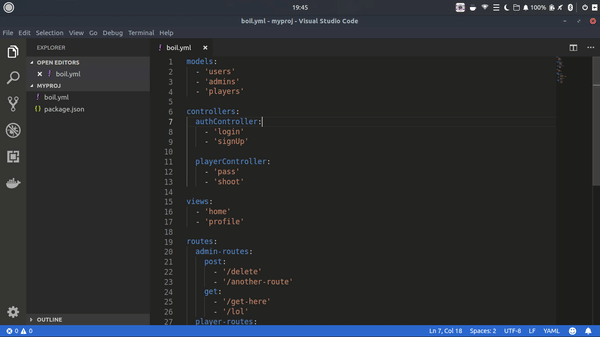

[](https://www.npmjs.com/package/node-boiler) [](https://travis-ci.org/mayankshah1607/node-boiler) [](https://github.com/mayankshah1607/node-boiler/edit/master/LICENSE) [](http://makeapullrequest.com) 

:computer: A simple and flexible plug-and-play CLI tool that can automate boilplate code generation for your next RESTful API built with NodeJS.

## Demo



## Installation

This [Node.js](https://nodejs.org/en/) module is available through [npm registry](https://www.npmjs.com/package/node-boiler)

Install the module globally by running the following command
```
$ npm i -g node-boiler
```
> Note: Not installing it gloabally may cause it to malfunction. We're working on the fix.

## Usage

1. Create a `boil.yml` file in your project directory specifying your configuration. Scroll below to see the semantic rules for writing your own `boil.yml` 
> example `boil.yml`

```
models:
  - 'users'
  - 'admins'
  - 'players'

controllers:
  authController:
    - 'login'
    - 'signUp'

  playerController:
    - 'pass'
    - 'shoot'

views:
  - 'home'
  - 'profile' 

routes:
  admin-routes:
    post:
      - '/delete'
      - '/another-route'
    get:
      - '/get-here'
      - '/lol'
  player-routes:
    get:
      - '/shoot'
      - '/kick'
```

2. Generate directories and files as per your configuration

```
$ cd yourprojectdirectory
$ sudo nodeboil
```

3. Your root project directory will then look like

```
 --node_modules
   |--your modules
 --models
   |--users.js
   |--admins.js
   |--players.js
 --views
   |--home.html
   |--profile.html
 --controllers
   |--authController.js
   |--playerController.js
 --routes
   |--admin-routes.js
   |--player-routes.js
 --boil.yml
 --package.json
 -- <entry file>.js
```
> Note: The generated files will come with all basic boiler plate code. Try it out!

## Writing boil.yml file

This file must be present in the root directory of your project. The syntax for writing `boil.yml` is as follows

```
models:
  - '<Model Name 1>'
  - '<Model Name 2>'
  ...
routes
  - <name of route file 1>
    - <route method>
      - '<URL endpoint 1>'
      - '<URL endpoint 2>'
      ...
     ...
  - <name of route file 2>
    - <route method>
      - '<URL endpoint 1>'
      - '<URL endpoint 2>'
      ...
     ...
  ...
  
controllers:
  - <Name of controller 1>
    - '<Function name 1>'
    - '<Function name 2>'
    ...
  - <Name of controller 2>
    '<Function name 1>'
    '<Function name 2>'
    ...
  ...

views:
  - '<Name of html file 1>'
  - '<Name od html file 2>'
  ...
```
Once done, execute the command ```sudo nodeboil``` in the root of the project directory.
> Note: Renaming the file to anything other than `boil.yml` will not work

## Features
* Generates all your mongoose models
> Example of a generated model file (admin.js) under the generated directory /models
```
const mongoose = require('mongoose');
const Schema = mongoose.Schema;
        
const adminsSchema = new Schema({}); //Write your schema here
        
const admins = mongoose.model('admins', adminsSchema); 
     
module.exports = admins;
```

* Generates routes as per your configuration
> Example of a generates routes file (admin-routes.js) under the generated directory /routes
```
const router = require('express').Router;

router.post('/delete', (req, res) => {}); // Add your route logic here
router.post('/another-route', (req, res) => {}); // Add your route logic here
router.get('/get-here', (req, res) => {}); // Add your route logic here
router.get('/lol', (req, res) => {}); // Add your route logic here

module.exports = router;
```

* Generates basic html templates under the generated directory /views
* Generates controllers for your REST APIs as per your configuration
> Example of a generated controller file (authController.js) under the generated directory /controllers
```
module.exports = {
login: function(){},// Add function logic here
signUp: function(){},// Add function logic here
}
```

## Tests
To run the test suite, execute the following command :
```
$ npm install
$ npm run test
```

## Related
https://dev.to/mayankshah1607/generating-boiler-plate-code-for-nodejs-rest-apis-fpb

## Contributing
When contributing to this repository, please first discuss the change you wish to make via issue, email, or any other method with the owners of this repository before making a change.

We are always looking forward to new ideas and meaningful contributions.

## License
[MIT](https://github.com/mayankshah1607/node-boiler/blob/master/LICENSE)
